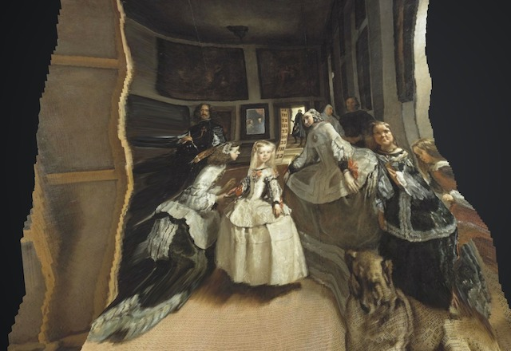

# Depth Painter

This software renders a canvas image in 3D space by using its corresponding depth map.		
It also includes some cool animations and camera traveling.

See some examples in [A Deep Look Inside Paintings](https://valillon.github.io/a-deep-look-inside-paintings).

## Dependencies

[OpenFrameworks](https://openframeworks.cc) and optionally [ofxLeapMotion](https://github.com/ofTheo/ofxLeapMotion) to navigate through.	

## Camera projection

A focal projection locates the points (pixels) in the 3D space according to:

- `focal`: distance from the camera to the canvas.
- `extrusion`: separation factor applied to the canvas depth range.

High focal values converge the projection to a parallel projection.	

## Sources

This repository does not contain audio files, neither images or depth maps.			
Be sure to include your own sources in `/bin/data` and load them properly in `setupAudio()` and `loadExample()`.	
Awesome depth maps can be generated with [MegaDepth](https://github.com/lixx2938/MegaDepth).	

## Notes

Comment the macros `SOUND_ON`, `ANIMATIONS_ON`, `LEAP_MOTION_ON` to disable undesired functionalities.	
After launching the app, type `h` for a complete list of key-stroke actions.		

---
Rafael Redondo (c) 2019.